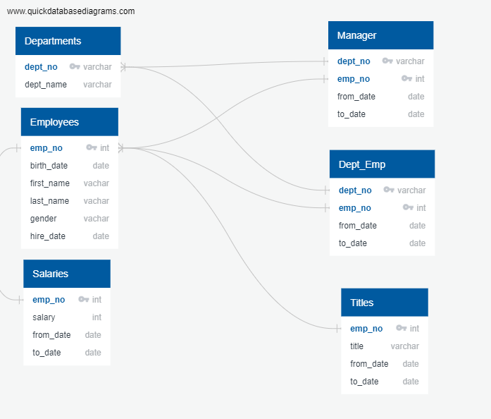

# Pewlett-Hackard-Analysis 
## Overview of the analysis

The purpose of this analysis is to conduct a research for Pewlett Hackward with determining the number of retiring employees, their title, and identifying employees who qualified in a mentorship program. This analysis will be helpful in the hiring process so Pewlett Hackward knows detailed information of necessary employees with a specific title and department. 

## Results 

Picture abouve is an ERD (Entity Relationship Diagram) that was created in visualing the relationship between the each table containing datas of employees, departments,salaries, Manager, Department of Employees and Titles.

- 

